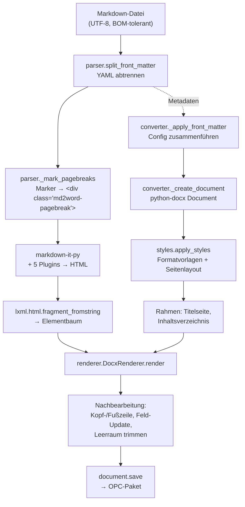

# SPEC — Technischer Unterbau von md2word

Dieses Dokument erklärt, wie md2word intern arbeitet: welchen Weg ein
Markdown-Text bis zur fertigen `.docx` nimmt, welche Entscheidungen dahinter
stehen und wo die OOXML-Fallstricke liegen, die den Großteil der Arbeit
ausgemacht haben.

Die Bedienung steht im [README](README.md). Hier geht es um das Innenleben — für
alle, die den Code erweitern, debuggen oder einschätzen wollen.

---

## Inhalt

1. [Die Pipeline im Überblick](#1-die-pipeline-im-überblick)
2. [Was eine .docx-Datei eigentlich ist](#2-was-eine-docx-datei-eigentlich-ist)
3. [Modulaufbau](#3-modulaufbau)
4. [Stufe 1: Markdown → HTML](#4-stufe-1-markdown--html)
5. [Stufe 2: HTML-Baum → Word-Dokument](#5-stufe-2-html-baum--word-dokument)
6. [Die OOXML-Handarbeit](#6-die-ooxml-handarbeit)
7. [Konfigurationsauflösung](#7-konfigurationsauflösung)
8. [Maßeinheiten](#8-maßeinheiten)
9. [PyInstaller: die drei Fallstricke](#9-pyinstaller-die-drei-fallstricke)
10. [Validierung und Teststrategie](#10-validierung-und-teststrategie)
11. [Erweiterungspunkte](#11-erweiterungspunkte)
12. [Bewusste Kompromisse](#12-bewusste-kompromisse)

---

## 1. Die Pipeline im Überblick



Der Ablauf in `converter.convert_text` ist bewusst als feste Reihenfolge
geschrieben, nicht als flexible Plugin-Kette. Die Reihenfolge ist an mehreren
Stellen bedeutsam:

| Schritt | Muss vorher passieren, weil … |
|:--------|:------------------------------|
| Front Matter auswerten | … die Konfiguration alles Weitere steuert, inklusive der Anführungszeichen beim Parsen |
| `apply_styles` | … der Renderer Formatvorlagen über ihre `styleId` zuweist; fehlt eine, gibt es einen `KeyError` |
| `enable_heading_numbering` | … es die Überschriftenformate ändert, die danach nur noch benutzt werden |
| Titelseite und Verzeichnis | … sie am Dokumentanfang stehen und python-docx nur anhängen kann |
| Renderer | … der Inhalt hinter den Rahmen gehört |
| Kopf-/Fußzeile | … sie einen eigenen Part erzeugen, unabhängig vom Textfluss |
| Leerraum trimmen | … erst dann alle Absätze existieren, auch die im Fußnoten-Part |

---

## 2. Was eine .docx-Datei eigentlich ist

Ohne dieses Modell ist der Rest schwer zu lesen. Eine `.docx` ist ein
**ZIP-Archiv nach dem OPC-Standard** (Open Packaging Conventions) mit
XML-Dateien darin, die *Parts* heißen:

```
demo.docx
├── [Content_Types].xml          Welcher Part hat welchen MIME-Typ
├── _rels/.rels                  Einstieg: wo liegt das Hauptdokument
└── word/
    ├── document.xml             Der Textkörper
    ├── styles.xml               Alle Formatvorlagen
    ├── numbering.xml            Listendefinitionen
    ├── settings.xml             Dokumenteinstellungen
    ├── footnotes.xml            Fußnotentexte           ← legt md2word selbst an
    ├── footer1.xml              Fußzeile                ← nur bei --page-numbers
    ├── media/image1.png         Eingebettete Bilder
    └── _rels/document.xml.rels  Beziehungen des Hauptdokuments
```

Drei Regeln gelten durchgängig und erklären fast jeden Sonderfall im Code:

**Erstens: Jeder Part braucht einen Eintrag in `[Content_Types].xml`.** Fehlt
er, verweigert Word die Datei komplett. python-docx erzeugt die Datei beim
Speichern automatisch aus den `content_type`-Angaben aller Parts — deshalb
genügt es, einen Part korrekt zu konstruieren.

**Zweitens: Verweise zwischen Parts laufen über Relationships, nicht über
Pfade.** Ein Bild im Text steht nicht als Dateiname im `document.xml`, sondern
als `r:id="rId7"`; erst `word/_rels/document.xml.rels` löst `rId7` zu
`media/image1.png` auf. Dasselbe gilt für externe Hyperlinks und den
Fußnoten-Part. Ein `r:id` ohne passenden Eintrag macht die Datei ungültig —
darum prüft die Testsuite genau das.

**Drittens: Die Elementreihenfolge ist schemagebunden.** WordprocessingML
schreibt in vielen Elementen eine feste Kindfolge vor (`xsd:sequence`). Ein
`w:abstractNum` nach einem `w:num` in `numbering.xml` ist ebenso ungültig wie
ein `w:pStyle` nach `w:numPr` innerhalb von `w:pPr`. python-docx hält die
Reihenfolge für die Elemente ein, die es selbst kennt; bei handgebautem XML
liegt die Verantwortung bei uns.

### Warum python-docx und nicht direkt lxml?

python-docx nimmt die OPC-Buchhaltung ab — Paket schreiben, Content-Types
pflegen, Relationship-IDs vergeben, Bilder deduplizieren, `sectPr` verwalten.
Seine *Inhalts-API* deckt aber nur einen Bruchteil von WordprocessingML ab: kein
Fußnoten-Support, keine Feldfunktionen, keine Hyperlinks, keine
Nummerierungsdefinitionen, keine Absatzrahmen oder Schattierungen.

md2word nutzt deshalb beide Ebenen: die hohe API für alles Vorhandene, und für
den Rest direkten Zugriff auf den lxml-Baum darunter (`paragraph._p`,
`run._r`, `cell._tc`). Diese Zugriffe sind bewusst in **`docxutil.py`**
gebündelt, damit der Renderer selbst lesbar bleibt und ein API-Bruch von
python-docx nur eine Datei betrifft.

---

## 3. Modulaufbau

```
cli.py          Argumente → Config, Dateinamen, Stapelverarbeitung, Exit-Codes
   ↓
converter.py    Ablaufsteuerung: Dokument aufbauen, Rahmen setzen, speichern
   ↓        ↘
parser.py    renderer.py     Markdown→HTML   |   HTML-Baum→Word
                ↓      ↘
          styles.py   docxutil.py   images.py   highlight.py
                ↓          ↓
              config.py (von allen gelesen, hängt von nichts ab)
```

Die Abhängigkeiten zeigen strikt nach unten; es gibt keine Zyklen. `config.py`
importiert nichts aus dem Projekt und lässt sich isoliert testen.

| Modul | Verantwortung | Kennt OOXML? |
|:------|:--------------|:-------------|
| `cli.py` | Kommandozeile, Ein-/Ausgabepfade, Fehlerausgabe | nein |
| `config.py` | Alle Einstellungen, Farbschemata, abgeleitete Größen | nein |
| `parser.py` | Markdown → HTML, Front Matter, Sprachlogik | nein |
| `converter.py` | Reihenfolge, Titelseite, Verzeichnis, Kopf-/Fußzeile | wenig |
| `renderer.py` | HTML-Baum → Absätze, Runs, Tabellen | mittelbar |
| `styles.py` | Formatvorlagen, Seitenlayout | ja |
| `docxutil.py` | Die gesamte XML-Handarbeit | vollständig |
| `images.py` | Bildquellen laden, Abmessungen bestimmen | kaum |
| `highlight.py` | Pygments-Tokens → Farbfragmente | nein |

---

## 4. Stufe 1: Markdown → HTML

### 4.1 Front Matter vor dem Parser

Der YAML-Block wird in `parser.split_front_matter` per Regex abgetrennt, **bevor**
markdown-it den Text sieht. Das hat einen konkreten Grund: Die Sprache aus dem
Front Matter bestimmt, welche Anführungszeichen der Typograf einsetzt. Würde man
das Front Matter erst nach dem Parsen auswerten, stünden die Zeichen schon fest.

`mdit_py_plugins.front_matter` ist trotzdem aktiv — als Netz für Dateien, deren
Block das Regex nicht trifft. Dann verschluckt das Plugin ihn wenigstens, statt
ihn als Text auszugeben.

Ohne PyYAML fällt `_parse_yaml` auf ein Minimalverfahren für `schlüssel: wert`
zurück. Ungültiges YAML wird geschluckt und liefert ein leeres Dictionary — ein
Tippfehler in den Metadaten darf die Konvertierung nicht verhindern.

### 4.2 Seitenumbruch-Marker

Drei Schreibweisen (`<!-- pagebreak -->`, `\newpage`, `{{pagebreak}}`, jeweils
mit Varianten) werden vor dem Parsen zu `<div class="md2word-pagebreak"></div>`.
Der Umweg über HTML ist der einfachste Weg, ein eigenes Konstrukt durch
markdown-it zu schleusen, ohne einen eigenen Block-Parser zu schreiben.

### 4.3 Die Preset-Falle

```python
MarkdownIt("commonmark", {"html": True, "linkify": True, "typographer": True})
    .enable(["table", "strikethrough", "linkify", "replacements", "smartquotes"])
```

Das `typographer: True` allein bewirkt **nichts**, wenn das Preset
`commonmark` geladen ist: Dieses Preset schaltet die Core-Regeln
`replacements` und `smartquotes` explizit ab. Sie müssen zusätzlich per
`.enable()` reaktiviert werden. Das ist während der Entwicklung aufgefallen,
weil ein Test typografische Anführungszeichen erwartete und keine bekam.

Aktivierte Erweiterungen: Tabellen, Durchstreichung, Autolinks, Front Matter,
Fußnoten, Definitionslisten, Aufgabenlisten, Dollar-Mathematik.

### 4.4 Anführungszeichen nach Sprache

`parser.quotes_for` bildet den Sprachcode auf die `quotes`-Option von
markdown-it ab — vier Einträge: öffnend und schließend für die äußere, dann für
die innere Ebene.

| Sprachgruppe | Zeichen |
|:-------------|:--------|
| `de`, `cs`, `sk`, `sl`, `hr`, `hu`, `pl`, `ro`, `lt`, `et`, `is` | `„…“ ‚…‘` |
| `fr` | `« … »` mit schmalem geschütztem Leerzeichen |
| `ru`, `es`, `it`, `pt`, `no`, `el`, `tr`, `uk`, `be` | `«…» ‹…›` |
| alle übrigen | `“…” ‘…’` |

**Warum ein Tupel und kein String.** markdown-it greift über den Index zu:
`quotes[0]` bis `quotes[3]`. Bei einem String sind das einzelne Zeichen — ein zu
langer String liefert deshalb stillschweigend die falschen. Genau das war
zwischenzeitlich der Fall: Der Eintrag `"«  »‹›"` sollte Guillemets
mit schmalem Abstand ergeben, hatte aber sechs Zeichen, sodass als schließendes
Anführungszeichen ein Leerzeichen herauskam — aus `« Bonjour »` wurde
`« Bonjour .`. Mit Tupeln lassen sich mehrzeichige Einträge sauber ausdrücken,
und `test_every_quote_set_has_exactly_four_entries` sichert die Länge ab.

Die Zeichen stehen im Quelltext als Escape-Sequenzen (`" "`), nicht als
Literale. Unsichtbare Zeichen im Code überleben Umformatierungen nicht
zuverlässig — auch das ist während der Entwicklung passiert und hat die
Leerraumbehandlung stillschweigend lahmgelegt.

### 4.5 `--strip-html`

Naheliegend wäre `html: False` gewesen — falsch. Dann behandelt markdown-it
rohes HTML nicht als eigenen Token, sondern als gewöhnlichen Text und gibt ihn
maskiert aus: `&lt;div&gt;verworfen&lt;/div&gt;` erscheint sichtbar im
Dokument. Genau das Gegenteil der Absicht.

Richtig ist, `html: True` zu lassen — damit die Tokens `html_block` und
`html_inline` überhaupt entstehen — und ihre Ausgabe zu unterdrücken:

```python
md.add_render_rule("html_block", lambda *args: "")
md.add_render_rule("html_inline", lambda *args: "")
```

---

## 5. Stufe 2: HTML-Baum → Word-Dokument

### 5.1 Warum überhaupt der Umweg über HTML?

markdown-it liefert einen **flachen Token-Strom** mit `*_open`/`*_close`-Paaren.
Wer daraus direkt Word-Absätze baut, muss die Verschachtelung selbst als Stack
mitführen — für jede Kombination aus Liste, Zitat, Tabelle und Codeblock. Ein
Elementbaum bringt diese Struktur bereits mit; eine Rekursion über die Kinder
genügt, und `lxml` repariert nebenbei unvollständiges HTML.

Der Preis ist eine zusätzliche Serialisierung nach HTML und ein erneutes Parsen.
Bei typischen Dokumentgrößen ist das nicht messbar; die gesamte Konvertierung des
Beispieldokuments dauert unter einer Zehntelsekunde.

### 5.2 Zwei Vorläufe vor dem eigentlichen Rendern

**`_collect_footnotes`** schneidet den `<section class="footnotes">`-Block, den
markdown-it ans Dokumentende hängt, samt vorangehendem `<hr>` heraus und legt
die `<li>`-Elemente in einem Dictionary ab. Nötig, weil Word-Fußnoten *an der
Verweisstelle* erzeugt werden müssen, nicht am Ende. Die Rückverweispfeile
(`↩︎`) werden dabei entfernt — im Word-Dokument navigiert man per Doppelklick.

**`_prescan_headings`** vergibt für jede Überschrift eine Anker-ID nach
GitHub-Art (`dx.slugify`) und hinterlegt sie als Attribut am Element. Der
Vorlauf ist zwingend: Ein Verweis `[Text](#kapitel-3)` kann vor der zugehörigen
Überschrift stehen, und beim Anlegen des Hyperlinks muss bereits feststehen, ob
das Ziel existiert. Bei doppelten Überschriften hängt `slugify` `-1`, `-2` an.

### 5.3 Block- und Inline-Ebene

Der Renderer arbeitet auf zwei Ebenen, die sich an HTML orientieren:

- **Blockebene** (`_render_block`) erzeugt Absätze und Tabellen. Ein Dictionary
  bildet Tagnamen auf Methoden ab; unbekannte Blöcke landen bei
  `_block_container`, das die Hülle verwirft und den Inhalt weiterverarbeitet.
- **Inlineebene** (`_render_inline_node`) erzeugt Runs innerhalb eines Absatzes.

Trifft die Blockebene auf ein Inline-Tag, öffnet sie einen Absatz. Trifft die
Inlineebene auf ein Blockelement — was bei kaputtem HTML vorkommt — wird dessen
Text übernommen, statt einen ungültigen verschachtelten Absatz zu bauen.

### 5.4 `InlineFormat`: Formatierung wächst beim Abstieg

```python
@dataclass
class InlineFormat:
    bold, italic, underline, strike, code, superscript, subscript,
    small_caps, color, highlight, font, size, link
```

Ein unveränderliches Wertobjekt, das beim Abstieg durch `<strong><em><code>`
per `merged()` kopiert und erweitert wird. Erst wenn Text erreicht ist, entsteht
ein Run mit den gesammelten Eigenschaften. Dadurch ergibt sich beliebig tiefe
Verschachtelung von selbst, ohne Stack-Verwaltung.

### 5.5 `RenderState`: wohin geschrieben wird

```python
@dataclass
class RenderState:
    container      # Document, _Cell oder None (Fußnote)
    list_stack     # offene Listen, bestimmt die Ebene
    quote_depth    # Verschachtelungstiefe von Zitaten
    indent_mm      # zusätzlicher Einzug
    in_footnote
```

`container` ist der Schlüssel für Tabellenzellen: Sowohl `Document` als auch
`_Cell` bieten `add_paragraph()` und `add_table()`. Der Renderer schreibt gegen
diese gemeinsame Schnittstelle und funktioniert deshalb in Zellen genauso wie im
Textkörper — inklusive Listen und Codeblöcken in Tabellen.

### 5.6 Nachbearbeiten statt vorausplanen

Zwei Fälle lassen sich beim Abstieg nicht sauber lösen, weil erst hinterher
feststeht, welche Absätze entstanden sind:

**Zitate.** `_block_quote` merkt sich den Absatzzählerstand, rendert die Kinder
ganz normal und geht danach über alles Neue: Absatzformat auf *Quote*, Einzug
nach Tiefe. Überschriften und Codeblöcke bleiben ausgenommen, damit sie ihr
eigenes Format behalten. Absätze, die **bereits** das Zitatformat tragen,
stammen aus einem inneren Zitat und werden übersprungen — sonst würde der äußere
Durchlauf die Staffelung wieder einebnen. Genau dieser Fehler ist in der
Entwicklung aufgetreten und wird von
`test_nested_blockquote_indents_further` abgesichert.

**Folgeblöcke in Listenpunkten.** Ein zweiter Absatz, eine Tabelle oder ein
Codeblock innerhalb eines Listenpunkts darf kein Aufzählungszeichen bekommen,
muss aber auf gleicher Höhe eingerückt sein. Auch hier: rendern, dann den Einzug
der neuen Absätze nachziehen.

Ein verwandter Fehler steckte im ersten Wurf von `_render_list_item`: Die
Bedingung `if tag == "p" and not pending_blocks` schickte *jeden* Absatz eines
„losen" Listenpunkts in den ersten Word-Absatz, solange noch kein Block
zurückgestellt war — zwei Absätze klebten aneinander. Ein explizites
`first_paragraph_used`-Flag löst das.

---

## 6. Die OOXML-Handarbeit

Alles in diesem Abschnitt liegt in `docxutil.py` und `styles.py`.

### 6.1 Formatvorlagen: `styleId` ist nicht der Name

Jede Formatvorlage hat zwei Bezeichner: die interne `w:styleId` und den
sichtbaren `w:name`. Word zeigt den Namen in der Oberfläche und lokalisiert ihn
(„Heading 1" wird zu „Überschrift 1"), verweist intern aber immer über die ID.
python-docx' `document.styles["Name"]` sucht über den Namen und warnt seit
Version 1.x bei ID-Zugriff.

md2word arbeitet durchgängig mit IDs — sie sind stabil und
sprachunabhängig — und umgeht die Warnung mit **`styles.StyleLookup`**, einem
Dictionary `styleId → Style-Objekt`, das sich bei einem Fehlschlag einmal neu
aufbaut.

Die gewählten IDs entsprechen denen aus **Pandocs Referenzdokument**:

| Zweck | styleId | Herkunft |
|:------|:--------|:---------|
| Codeblock | `SourceCode` | Pandoc |
| Code im Text | `VerbatimChar` | Pandoc |
| Zitat | `Quote` | Word-Standard |
| Bildunterschrift | `Caption` | Word-Standard |
| Bildabsatz | `Figure` | Pandoc |
| Trennlinie | `HorizontalRule` | Pandoc |
| Definitionsliste | `DefinitionTerm`, `Definition` | Pandoc |
| Tabellentext | `Compact` | Pandoc |
| Titelseiten-Metazeile | `Author` | Pandoc |

Das kostet nichts und bringt zwei Dinge: Ein für Pandoc gebautes
Referenzdokument funktioniert unverändert mit `--reference-doc`, und der Rückweg
`docx → Markdown` erkennt Code, Zitate und Bildunterschriften wieder statt sie
als formlosen Text auszugeben.

Beim Anlegen fehlender Vorlagen setzt `ensure_style` die `styleId` nach dem
Erzeugen direkt am XML-Element und entfernt bei echten Word-Vorlagen das
Attribut `w:customStyle`, damit Word sie als eingebaut behandelt.

#### `StyleBuilder`: Referenzvorlagen dürfen gewinnen

Ohne `--reference-doc` überschreibt md2word alle Formatvorlagen nach
Konfiguration. Mit `--reference-doc` wäre das falsch — dann wäre die Vorlage
sinnlos. `StyleBuilder.style()` liefert deshalb `None`, wenn die Vorlage schon
existiert und respektiert werden soll; der Aufrufer lässt sie dann in Ruhe. Neue
Vorlagen werden trotzdem ergänzt, sonst gäbe es kein Codeblock-Format.

Analog beim Seitenlayout: Es bleibt wie in der Vorlage, es sei denn,
`--page-size`, `--landscape` oder ein `--margin` steht ausdrücklich auf der
Kommandozeile. Dafür wird `config._explicit` ausgewertet (siehe [Abschnitt 7](#7-konfigurationsauflösung)).

### 6.2 Listen: `numbering.xml` von Hand

Word trennt Listen in zwei Ebenen:

- **`w:abstractNum`** — das Aussehen: neun Ebenen mit Zeichen oder
  Nummernformat, Einzug, Schrift.
- **`w:num`** — eine *Instanz*, die auf ein `abstractNum` verweist. Absätze
  referenzieren immer eine `numId`, nie das abstrakte Format.

Diese Trennung ist der Grund für eine wichtige Eigenschaft:

> **Jede Liste im Dokument bekommt eine eigene `w:num`-Instanz.**

Teilten sich zwei aufeinanderfolgende nummerierte Listen eine `numId`, würde
Word die zweite bei 3 statt bei 1 fortsetzen. `NumberingRegistry.new_list()`
legt darum pro Liste eine neue Instanz an — die abstrakten Definitionen (je eine
für Punkte und Nummern) werden dagegen wiederverwendet. Abgesichert durch
`test_ordered_lists_restart`.

Weitere Details:

- **Schemareihenfolge.** Alle `w:abstractNum` müssen vor allen `w:num` stehen.
  `_insert_abstract` hängt neue Definitionen deshalb hinter die letzte
  vorhandene, nicht ans Ende. Die Testsuite prüft die Reihenfolge eigens, weil
  Word sonst die Reparatur anbietet.
- **Startwerte.** `5. fünf` erzeugt ein `w:lvlOverride` mit `w:startOverride`
  auf der Instanz — das abstrakte Format bleibt unberührt.
- **Ebenengrenze.** Word kennt `w:ilvl` 0 bis 8. `apply_numbering` begrenzt
  darauf (`MAX_LIST_LEVEL`); tiefere Verschachtelungen laufen auf Ebene 8
  zusammen, statt eine ungültige Datei zu erzeugen.
- **Einzug.** `w:left = 720 × (Ebene + 1)` Twips bei `w:hanging = 360` —
  das entspricht Words eigener Staffelung von 1,27 cm je Ebene.
- **Zeichen.** Ebenen wechseln zyklisch zwischen `` (Symbol), `o`
  (Courier New) und `` (Wingdings), nummerierte zwischen `decimal`,
  `lowerLetter` und `lowerRoman`.

Für nummerierte Überschriften baut `enable_heading_numbering` eine eigene
mehrstufige Definition, deren Ebenen per `w:pStyle` an `Heading1`…`HeadingN`
gebunden sind, und trägt die `numId` zusätzlich in die Formatvorlagen ein. Die
Nummern gehören dann zum Format, nicht zum einzelnen Absatz — Word zählt selbst
und aktualisiert beim Einfügen neuer Kapitel.

### 6.3 Echte Fußnoten

Der aufwendigste Teil. python-docx kennt keine Fußnoten; die Vorlage enthält
nicht einmal einen `footnotes.xml`-Part. `FootnoteStore` legt ihn selbst an:

**Schritt 1 — Part erzeugen.** Ein `XmlPart` mit Pfad `/word/footnotes.xml` und
dem Content-Type
`application/vnd.openxmlformats-officedocument.wordprocessingml.footnotes+xml`,
danach `document_part.relate_to(part, RT.FOOTNOTES)`. Der Eintrag in
`[Content_Types].xml` entsteht beim Speichern automatisch aus dem `content_type`
des Parts — ein Grund, `XmlPart` zu verwenden statt Rohbytes.

**Schritt 2 — Pflichteinträge.** Word erwartet zwei besondere Fußnoten vor allen
echten: `w:type="separator"` mit `w:id="-1"` (die Trennlinie über dem
Fußnotenbereich) und `w:type="continuationSeparator"` mit `w:id="0"` (die Linie
bei Fortsetzung auf der Folgeseite). Fehlen sie, öffnet Word die Datei zwar,
zeigt aber keine Trennlinie. Echte Fußnoten beginnen bei `w:id="1"`.

**Schritt 3 — `settings.xml`.** Ein `w:footnotePr` mit Verweisen auf die IDs
`-1` und `0`, eingefügt an Position 0, weil `w:footnotePr` in der
Elementreihenfolge von `w:settings` weit vorn steht.

**Schritt 4 — Verweis im Text.** Ein Run mit dem Zeichenformat
`FootnoteReference` (hochgestellt) und einem `w:footnoteReference w:id="n"`.

**Schritt 5 — Inhalt.** Der erste Absatz jeder Fußnote beginnt mit einem Run,
der `w:footnoteRef` enthält — das Platzhalterelement für die automatisch
vergebene Nummer. Word nummeriert selbst; im XML steht nirgends eine Ziffer.

**Der Trick beim Befüllen.** Der Renderer schreibt Inline-Inhalt über
`docx.text.paragraph.Paragraph`-Objekte. Für Fußnoten wird ein solches Objekt um
ein rohes `w:p` im Fußnoten-Part gelegt:

```python
target = Paragraph(first_p, self._footnotes._part)
```

Der zweite Parameter ist das Elternobjekt, über das `paragraph.part` aufgelöst
wird. Da `XmlPart.part` sich selbst zurückgibt, landen Hyperlink-Relationships
aus Fußnoten korrekt in `word/_rels/footnotes.xml.rels` statt fälschlich im
Hauptdokument. Damit funktioniert der komplette Inline-Renderer unverändert
innerhalb von Fußnoten — samt Formatierung, Links und Code.

Schlägt der Aufbau des Parts fehl, fällt der Renderer automatisch auf Endnoten
zurück und meldet das als Hinweis.

### 6.4 Feldfunktionen

Inhaltsverzeichnis und Seitenzahlen sind keine Texte, sondern **Felder**, die
Word selbst berechnet. Ein Feld besteht aus fünf aufeinanderfolgenden Runs:

```xml
<w:r><w:fldChar w:fldCharType="begin" w:dirty="true"/></w:r>
<w:r><w:instrText xml:space="preserve"> TOC \o "1-3" \h \z \u </w:instrText></w:r>
<w:r><w:fldChar w:fldCharType="separate"/></w:r>
<w:r><w:t>Platzhaltertext</w:t></w:r>
<w:r><w:fldChar w:fldCharType="end"/></w:r>
```

Zwischen `separate` und `end` steht das zwischengespeicherte Ergebnis — was
Word anzeigt, bevor es neu rechnet. md2word setzt dort einen Hinweistext, damit
niemand vor einem leeren Verzeichnis steht.

`w:dirty="true"` markiert das Feld als veraltet. Zusätzlich setzt
`force_field_update_on_open` ein `<w:updateFields w:val="true"/>` in
`settings.xml` — das ist der Grund für Words Nachfrage beim Öffnen.

Verwendete Feldanweisungen: `TOC \o "1-N" \h \z \u` (Verzeichnis über die
Ebenen 1–N, als Hyperlinks, ohne Seitenzahlen in der Webansicht, mit
Gliederungsebenen), `PAGE` und `NUMPAGES`.

Weil `begin` und `end` paarig sein müssen, prüft die Testsuite die Anzahl über
`document.xml` **und** alle Kopf-/Fußzeilen-Parts.

### 6.5 Hyperlinks und Lesezeichen

**Externe Links** brauchen eine Relationship mit `TargetMode="External"`.
`paragraph.part.relate_to(url, RT.HYPERLINK, is_external=True)` liefert die
`r:id`, die in ein `w:hyperlink`-Element wandert.

**Interne Links** brauchen keine Relationship, sondern
`<w:hyperlink w:anchor="ziel">` und ein passendes Lesezeichen. Für die
Lesezeichennamen gelten Word-Regeln, die `sanitize_bookmark` durchsetzt:
höchstens 40 Zeichen, nur Buchstaben, Ziffern und Unterstriche, kein
führender Ziffernbeginn. Aus dem Anker `mein-abschnitt` wird deshalb das
Lesezeichen `mein_abschnitt` — beide Seiten laufen durch dieselbe Funktion,
daher passen sie immer zusammen.

**Die Reihenfolge beim Bauen** ist heikel: `w:hyperlink` umschließt die Runs,
aber python-docx' `add_run()` hängt immer an den Absatz an. Der Renderer merkt
sich daher die Run-Anzahl vor dem Inhalt, rendert normal und verschiebt die neu
entstandenen Runs anschließend per `move_run_into` in das Hyperlink-Element.
Dadurch funktioniert beliebige Formatierung im Linktext.

Zeigt ein interner Verweis ins Leere, wird der Text unverlinkt ausgegeben und
eine Warnung gesammelt — kein Abbruch.

### 6.6 Codeblöcke

Word kennt keinen mehrzeiligen Absatz mit erhaltenen Umbrüchen, wie ihn `<pre>`
darstellt. Ein Codeblock wird deshalb zu **einem Absatz je Zeile** mit dem
Format `SourceCode` (Abstand 0, einfacher Zeilenabstand).

Das erzeugt ein Randproblem: Ein Rahmen um jeden Absatz ergäbe Trennstriche
zwischen den Zeilen. `_emit_code_block` setzt Rahmen daher gezielt — links und
rechts an allen Absätzen, oben nur am ersten, unten nur am letzten. Optisch
entsteht ein durchgehender Kasten. Geprüft von
`test_code_block_outer_borders_only`.

Die Syntaxhervorhebung kommt von Pygments als Folge von `(Token, Text)`-Paaren,
aus denen `highlight.py` Fragmente mit Farbe und Schnitt macht. Ein Fragment
kann Zeilenumbrüche enthalten, ein Word-Run darf das nicht — `_fragments_by_line`
verteilt die Fragmente daher auf Zeilen und schneidet an `\n`.

Ist die Sprache unbekannt oder Pygments nicht installiert, entsteht ein einziges
Fragment ohne Farbe. Kein Fehler, nur kein Farbverlauf.

### 6.7 Tabellen

**Spaltenbreiten** rechnet `_column_widths` selbst aus, statt Word entscheiden
zu lassen — Words Automatik dehnt Tabellen gern über den Satzspiegel hinaus. Die
Heuristik:

1. Je Spalte die längste vorkommende Zellenlänge ermitteln, bei 60 Zeichen
   gekappt (verhindert, dass eine Fließtextspalte alles schluckt).
2. Die verfügbare Textbreite proportional zu diesen Gewichten verteilen.
3. Jede Spalte auf 45 % bis 220 % der Durchschnittsbreite begrenzen — damit
   bleiben schmale Spalten lesbar und breite beherrschbar.
4. Das Ergebnis wieder auf die Textbreite normieren, damit die Summe exakt passt.

Dazu `w:tblLayout w:type="fixed"`, sonst ignoriert Word die Vorgaben.
`test_wide_table_stays_within_page` prüft mit zwölf Spalten, dass die Summe
unter dem Satzspiegel bleibt.

Kopfzeilen bekommen `w:tblHeader` (Wiederholung auf jeder Seite), alle Zeilen
`w:cantSplit` (kein Umbruch mitten in der Zeile). Die Spaltenausrichtung aus
`|:--|--:|` steht als `style="text-align:…"` am `<td>` und wird auf die Absätze
der Zelle übertragen.

Nach jeder Tabelle folgt ein leerer Absatz. Ohne ihn verschmelzen zwei direkt
aufeinanderfolgende Tabellen in Word zu einer einzigen.

### 6.8 Bilder

`images.load_image` vereinheitlicht drei Quellen — lokale Pfade (relativ zum
Verzeichnis der Markdown-Datei), `data:`-URIs und `http(s)`-Adressen — zu einem
Byte-Strom. SVG wird erkannt (Endung oder Inhalt) und, falls `cairosvg`
vorhanden ist, in PNG umgewandelt.

Die native Größe liefert `docx.image.image.Image.from_blob`, das die DPI-Angabe
der Datei berücksichtigt; scheitert das, springt Pillow mit 96 dpi als Annahme
ein. Verkleinert wird nur, wenn das Bild breiter als der Satzspiegel ist —
kleine Bilder behalten ihre Größe, statt aufgeblasen zu werden.

Jeder Fehler beim Laden ist nicht fatal: Es gibt einen kursiven Platzhalter
`[Bild: Alt-Text]` und eine gesammelte Warnung.

### 6.9 Leerraum

HTML und Word haben verschiedene Vorstellungen davon, was Leerraum bedeutet. In
HTML sind Zeilenumbruch und Einrückung nur Formatierung der Quelldatei; Word
zeigt jedes Zeichen. Drei Funktionen regeln die Übersetzung:

| Funktion | Verhalten | Verwendung |
|:---------|:----------|:-----------|
| `_collapse_soft` | Leerraumfolgen → ein Leerzeichen, Ränder bleiben | normale Textknoten |
| `_collapse` | zusätzlich beidseitig strippen | Attribute, Fallback-Texte |
| `_collapse_leading` | zusätzlich links strippen | Textbeginn eines Listenpunkts |

Im Code-Kontext (`InlineFormat.code`) wird nichts angetastet — dort ist Leerraum
Inhalt.

**Geschützte Leerzeichen sind ausgenommen.** Naheliegend wäre `re.sub(r"\s+", " ", …)`
gewesen — und falsch: Pythons `\s` trifft auch U+00A0 (geschütztes
Leerzeichen), U+202F (schmales geschütztes) und U+2007 (Ziffernbreite). Aus
`10&nbsp;kg` würde `10 kg` mit gewöhnlichem Leerzeichen, der Umbruchschutz wäre
weg — und die französischen Guillemets verlören ihren Abstand gleich mit.
Browser kollabieren `&nbsp;` ebenfalls nicht.

Die Muster schließen diese Zeichen deshalb aus:

```python
PROTECTED_SPACES = "   "
_COLLAPSIBLE = re.compile(rf"[^\S{PROTECTED_SPACES}]+")   # Leerraum außer den geschützten
```

Am Ende läuft `docxutil.trim_paragraph_edges` über alle Absätze in
`document.xml` und im Fußnoten-Part und entfernt gewöhnlichen Leerraum am Anfang
des ersten und am Ende des letzten `w:t` — geschützte Leerzeichen bleiben auch
dort stehen, wer sie schreibt, meint sie. Codeblöcke sind ausgenommen. Das
Verfahren setzt bei Bedarf `xml:space="preserve"` und entfernt das Attribut,
wo es überflüssig geworden ist.

Ohne diesen Durchlauf enden Absätze sichtbar mit einem Leerzeichen, weil
HTML-Zeilenumbrüche als solches ankommen.

---

## 7. Konfigurationsauflösung

Vier Quellen, in aufsteigender Priorität:

```
Standardwerte (config.Config)
    ↓ überschrieben von
Farbschema (THEMES[name]) — nur leere Felder
    ↓ überschrieben von
YAML-Front-Matter
    ↓ überschrieben von
Kommandozeile — aber nur, was dort ausdrücklich steht
```

Die letzte Zeile ist der Knackpunkt. `argparse` liefert für jede Option einen
Wert, auch wenn der Nutzer sie nie angegeben hat — anhand des Namespace lässt
sich also nicht unterscheiden, ob `--theme default` gewählt oder nur der
Standardwert eingesetzt wurde. Ohne diese Unterscheidung könnte ein `theme:
modern` im Front Matter nie wirken.

`cli._explicit_options` löst das, indem es das rohe `argv` gegen die
Optionsnamen des Parsers abgleicht und die Menge der tatsächlich genannten
Felder bildet. Diese Menge reist als `Config._explicit` mit;
`converter._apply_front_matter` verwirft Front-Matter-Werte für alles, was darin
steht. Dieselbe Menge entscheidet, ob eine Referenzvorlage ihr Seitenlayout
behalten darf.

`--margin 12` trägt zusätzlich alle vier Randfelder in die Menge ein, damit ein
einzelnes `--margin-left 40` danach noch gewinnen kann.

Unbekannte Front-Matter-Schlüssel wandern nach `Config._extra` statt zu einem
Fehler zu führen — eigene Projektfelder in den Metadaten stören nicht.

---

## 8. Maßeinheiten

OOXML verwendet je nach Kontext verschiedene Einheiten. Wer den Code liest,
stolpert sonst über Zahlen wie `size=18` für eine 2,25 pt starke Linie:

| Einheit | Umrechnung | Wo verwendet |
|:--------|:-----------|:-------------|
| **EMU** (English Metric Unit) | 914 400 / Zoll, 36 000 / mm | Bildgrößen, python-docx' `Mm()`, `Pt()` |
| **Twip** (1/20 Punkt) | 1 440 / Zoll, 635 EMU | Einzüge, Ränder, Zellenabstände |
| **Halbpunkt** | 2 pro Punkt | Schriftgrößen (`w:sz`) |
| **Achtelpunkt** | 8 pro Punkt | Rahmenstärken (`w:sz` in `w:pBdr`) |

Ein Rundungseffekt hat Testkonsequenzen: `Mm(8.0)` sind 288 000 EMU, gespeichert
wird aber in Twips (453,5 → 454), beim Zurücklesen ergibt das 288 290 EMU. Die
Tests vergleichen Längen deshalb mit Toleranz statt auf Gleichheit.

---

## 9. PyInstaller: die drei Fallstricke

**1. Die Word-Grundvorlage.** python-docx liefert `docx/templates/default.docx`
als Paketdatei mit. Der Import-Scanner sieht nur Python-Module, keine Daten —
ohne `collect_data_files("docx", …)` scheitert schon der erste
`Document()`-Aufruf.

**2. Das fehlende Verzeichnis `docx/parts/`.** Der subtilste Fehler. Die Module
dort bauen ihre Pfade so:

```python
path = os.path.join(os.path.split(__file__)[0], "..", "templates", "default-footer.xml")
```

Im Bundle liegen die Python-Module im PYZ-Archiv, nicht als Dateien. Im
entpackten Verzeichnis existiert `docx/templates/` (Datendateien), aber
`docx/parts/` nicht. Und das Betriebssystem kann `..` nur auflösen, wenn **jede**
Pfadkomponente existiert — auch die, die durch das `..` wieder verlassen wird.
Ergebnis: `FileNotFoundError` auf eine Datei, die sehr wohl im Bundle liegt.

Der Fehler tritt nur auf, wenn Kopf-/Fußzeilen, Kommentare, Einstellungen oder
Formatvorlagen nachgeladen werden — eine einfache Konvertierung läuft
durch. Ein Probelauf ohne `--page-numbers` hätte ihn nicht gefunden; deshalb
konvertiert `build.py` nach jedem Bau ein Dokument mit Verzeichnis **und**
Seitenzahlen und prüft das Ergebnis auf `word/footnotes.xml` und Konsorten.

Die Lösung ist eine beliebige Datei an dieser Stelle:

```python
datas.append((os.path.join(os.path.dirname(_docx.__file__), "py.typed"), "docx/parts"))
```

**3. Pygments lädt dynamisch.** Lexer und Farbschemata werden zur Laufzeit über
Namenstabellen aufgelöst, nicht importiert. Ohne
`collect_submodules("pygments.lexers")` und `…styles` baut alles fehlerfrei — und
im fertigen Programm fehlt jede Syntaxhervorhebung.

Verwandt: `linkify_it` und `uc_micro` werden von markdown-it nur bei
aktiviertem Linkify importiert und müssen als versteckte Importe angemeldet
werden.

### Ein Verzeichnis oder eine Datei

`--onefile` packt alles in eine Binärdatei, die sich bei **jedem** Start in
einen temporären Ordner entpackt. Auf macOS prüft Gatekeeper dabei jede der rund
hundert enthaltenen Bibliotheken einzeln — gemessen 6,5 s pro Aufruf gegenüber
0,3 s bei der Verzeichnisvariante. Deshalb ist das Verzeichnis die Voreinstellung.

Die Bauart wird über `sys.argv` in der Spec ausgewertet. PyInstaller reicht
alles nach `--` weiter, **entfernt den Trenner dabei aber** — eine Suche nach
`"--"` in `sys.argv` schlägt fehl. `build.py` setzt zusätzlich
`MD2WORD_ONEFILE=1` als zweiten Weg.

---

## 10. Validierung und Teststrategie

193 Tests in vier Dateien, ausgeführt gegen Python 3.9 und 3.14.

Der Kern ist `assert_valid` in `tests/conftest.py`. Jeder Test, der eine ganze
Datei erzeugt, schickt sie hindurch. Geprüft wird das OPC-Paket selbst, nicht
nur die python-docx-Sicht darauf:

| Prüfung | Fängt |
|:--------|:------|
| ZIP intakt, alle XML-Parts wohlgeformt | grobe Strukturschäden |
| Jeder Part hat einen Content-Type, jedes Override einen Part | Word verweigert die Datei |
| Alle Relationships lösen auf, alle `r:id` existieren | tote Bild- und Linkverweise |
| Jeder `pStyle`/`rStyle`/`tblStyle` existiert in `styles.xml` | Tippfehler in Style-IDs |
| `numId` definiert, `abstractNum` vor `num` | Reparaturdialog |
| Fußnotenverweise haben eine Definition | halbe Fußnoten |
| Lesezeichen paarig, jeder Anker hat ein Ziel | tote Querverweise |
| Kein `\n` in `w:t` | Zeilenumbrüche, die keine sind |
| `fldChar begin`/`end` paarig, inkl. Kopf-/Fußzeilen | zerbrochene Felder |

Diese Prüfungen ersetzen keinen echten Word-Start, decken aber genau die Fehler
ab, die zum Reparaturdialog führen. Ergänzend wurde das Ergebnis mit Pandoc
zurück nach Markdown gelesen — dabei fiel etwa auf, dass zwei Absätze eines
Listenpunkts aneinanderklebten.

`test_conversion_is_deterministic` stellt sicher, dass zweimaliges Konvertieren
desselben Texts byte-identische `document.xml` liefert — Voraussetzung dafür,
Ergebnisse überhaupt vergleichen zu können.

Die Randfall-Datei wirft bewusst kaputtes Markup gegen den Konverter:
unabgeschlossene Auszeichnung, Tabellen mit ungleicher Spaltenzahl, zwölffach
verschachtelte Listen, Steuerzeichen, Emoji, CJK, `\r`-Zeilenenden, BOM. Der
Anspruch ist nicht, alles sinnvoll darzustellen, sondern nie eine ungültige
Datei zu schreiben.

---

## 11. Erweiterungspunkte

**Ein neues Blockelement** braucht einen Eintrag im Dispatch-Dictionary von
`_render_block` und eine Methode `_block_xyz(node, state)`. Vorlage:
`_block_paragraph`.

**Ein neues Inline-Format** wird in `InlineFormat` als Feld ergänzt, in
`_extend_format` aus dem Tag abgeleitet und in `_apply_format` auf den Run
angewendet.

**Ein neues Farbschema** ist ein Eintrag in `config.THEMES` mit allen acht
Schlüsseln. Die CLI zieht die Auswahlliste automatisch daraus, und
`test_themes_apply_fonts` prüft jedes Schema per Parametrisierung — ein neues
Schema wird ohne Zutun mitgetestet.

**Ein neues Papierformat** ist ein Eintrag in `config.PAGE_SIZES`; auch dieser
Test ist parametrisiert.

**Eine neue Front-Matter-Option** gehört in `converter._OPTION_KEYS` mit ihrem
Zieltyp. Die Umwandlung übernimmt `_coerce`, das für Wahrheitswerte auch `ja`
und `nein` versteht.

**Echte Word-Formeln (OMML)** wären der größte offene Punkt. Der Weg führte über
LaTeX → MathML → OMML per XSLT (Microsofts `MML2OMML.xsl`) und ein neues
Modul, das das Ergebnis als `m:oMath` in den Absatz hängt. Die Anknüpfstellen
sind `_block_math` und der `math`-Zweig in `_render_inline_node`.

---

## 12. Bewusste Kompromisse

| Entscheidung | Grund | Preis |
|:-------------|:------|:------|
| Umweg über HTML statt Token-Strom | Verschachtelung kommt gratis, lxml repariert kaputtes Markup | zusätzliches Serialisieren und Parsen |
| python-docx statt reinem lxml | OPC-Buchhaltung, Bilder, Content-Types geschenkt | für die Hälfte der Elemente Handarbeit nötig |
| Formeln als formatierter Text | OMML-Erzeugung wäre ein eigenes Teilprojekt | keine bearbeitbaren Word-Formeln |
| Spaltenbreiten selbst berechnen | Words Automatik sprengt den Satzspiegel | Heuristik, keine perfekte Typografie |
| Ein Absatz je Codezeile | Word kann `<pre>` nicht abbilden | Rahmen müssen von Hand zusammengesetzt werden |
| Zitate per Nachbearbeitung | Tiefe steht erst nach dem Rendern fest | zwei Durchläufe über dieselben Absätze |
| Pandoc-kompatible Style-IDs | Referenzdokumente und Rückweg funktionieren | Bindung an fremde Namenskonventionen |
| Bilder standardmäßig herunterladen | entspricht dem Verhalten von Pandoc und Editoren | Netzzugriff beim Konvertieren, abschaltbar mit `--no-remote-images` |
| Verzeichnis statt Einzeldatei als Bau-Standard | zwanzigmal schnellerer Start | drei- bis vierfacher Platzbedarf |
