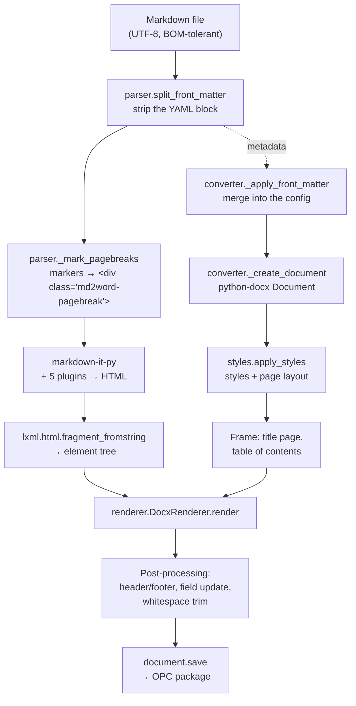

# SPEC — How md2word works internally

This document explains the machinery: the path a Markdown text takes to become a
finished `.docx`, the reasoning behind the design, and the OOXML traps that
accounted for most of the work.

For how to *use* the tool, see the [README](README.md). This is about the
internals — for anyone extending, debugging or evaluating the code.

---

## Contents

1. [The pipeline at a glance](#1-the-pipeline-at-a-glance)
2. [What a .docx file actually is](#2-what-a-docx-file-actually-is)
3. [Module layout](#3-module-layout)
4. [Stage 1: Markdown → HTML](#4-stage-1-markdown--html)
5. [Stage 2: HTML tree → Word document](#5-stage-2-html-tree--word-document)
6. [The hand-written OOXML](#6-the-hand-written-ooxml)
7. [Resolving configuration](#7-resolving-configuration)
8. [Units of measure](#8-units-of-measure)
9. [PyInstaller: the three pitfalls](#9-pyinstaller-the-three-pitfalls)
10. [Validation and test strategy](#10-validation-and-test-strategy)
11. [Extension points](#11-extension-points)
12. [Deliberate trade-offs](#12-deliberate-trade-offs)

---

## 1. The pipeline at a glance



The sequence in `converter.convert_text` is written as a fixed order on purpose,
not as a flexible plugin chain. The order matters in several places:

| Step | Has to come first because … |
|:-----|:----------------------------|
| Evaluate front matter | … the configuration drives everything else, right down to which quotation marks the parser uses |
| `apply_styles` | … the renderer assigns styles by `styleId`; a missing one is a `KeyError` |
| `enable_heading_numbering` | … it modifies the heading styles that are only *used* afterwards |
| Title page and TOC | … they belong at the start, and python-docx can only append |
| Renderer | … the content goes behind the frame |
| Header and footer | … they create their own parts, independent of the text flow |
| Whitespace trim | … only by then do all paragraphs exist, including those in the footnotes part |

---

## 2. What a .docx file actually is

Without this model the rest is hard to follow. A `.docx` is a **ZIP archive
following the OPC standard** (Open Packaging Conventions) containing XML files
called *parts*:

```
demo.docx
├── [Content_Types].xml          Which part has which MIME type
├── _rels/.rels                  Entry point: where the main document lives
└── word/
    ├── document.xml             The body text
    ├── styles.xml               All styles
    ├── numbering.xml            List definitions
    ├── settings.xml             Document settings
    ├── footnotes.xml            Footnote texts          ← md2word creates this itself
    ├── footer1.xml              Footer                  ← only with --page-numbers
    ├── media/image1.png         Embedded images
    └── _rels/document.xml.rels  Relationships of the main document
```

Three rules apply throughout and explain nearly every special case in the code:

**First: every part needs an entry in `[Content_Types].xml`.** Without one, Word
refuses the file outright. python-docx generates that file on save from the
`content_type` of each part — which is why constructing a part correctly is
enough.

**Second: references between parts go through relationships, not paths.** An
image in the text does not appear as a filename in `document.xml` but as
`r:id="rId7"`; only `word/_rels/document.xml.rels` resolves `rId7` to
`media/image1.png`. The same holds for external hyperlinks and the footnotes
part. An `r:id` without a matching entry invalidates the file — which is exactly
what the test suite checks.

**Third: element order is bound by the schema.** WordprocessingML prescribes a
fixed child order (`xsd:sequence`) in many elements. A `w:abstractNum` after a
`w:num` in `numbering.xml` is just as invalid as a `w:pStyle` after `w:numPr`
inside `w:pPr`. python-docx maintains the order for the elements it knows about;
for hand-built XML the responsibility is ours.

### Why python-docx and not lxml directly?

python-docx takes care of the OPC bookkeeping — writing the package, maintaining
content types, allocating relationship IDs, deduplicating images, managing
`sectPr`. Its *content* API, however, covers only a fraction of
WordprocessingML: no footnotes, no field codes, no hyperlinks, no numbering
definitions, no paragraph borders or shading.

md2word therefore works on both levels: the high-level API for everything it
offers, and direct access to the lxml tree underneath for the rest
(`paragraph._p`, `run._r`, `cell._tc`). Those accesses are deliberately
concentrated in **`docxutil.py`**, so the renderer itself stays readable and a
breaking change in python-docx only touches one file.

---

## 3. Module layout

```
cli.py          Arguments → Config, file names, batch processing, exit codes
   ↓
converter.py    Orchestration: build the document, set the frame, save
   ↓        ↘
parser.py    renderer.py     Markdown→HTML   |   HTML tree→Word
                ↓      ↘
          styles.py   docxutil.py   images.py   highlight.py
                ↓          ↓
              config.py (read by all, depends on nothing)
```

Dependencies point strictly downwards; there are no cycles. `config.py` imports
nothing from the project and can be tested in isolation.

| Module | Responsibility | Knows OOXML? |
|:-------|:---------------|:-------------|
| `cli.py` | Command line, input/output paths, error reporting | no |
| `config.py` | All settings, themes, derived measurements | no |
| `parser.py` | Markdown → HTML, front matter, language logic | no |
| `converter.py` | Ordering, title page, TOC, header and footer | a little |
| `renderer.py` | HTML tree → paragraphs, runs, tables | indirectly |
| `styles.py` | Styles, page layout | yes |
| `docxutil.py` | All the hand-written XML | entirely |
| `images.py` | Loading image sources, determining dimensions | barely |
| `highlight.py` | Pygments tokens → coloured fragments | no |
| `i18n.py` | Document-facing strings, per language | no |
| `omml.py` | LaTeX → MathML → Word equations | yes |

---

## 4. Stage 1: Markdown → HTML

### 4.1 Front matter before the parser

The YAML block is stripped by a regex in `parser.split_front_matter` **before**
markdown-it sees the text. There is a concrete reason: the language from the
front matter determines which quotation marks the typographer inserts. Reading
the front matter only after parsing would leave those characters already decided.

`mdit_py_plugins.front_matter` is still enabled — as a safety net for files whose
block the regex misses. The plugin at least swallows it rather than emitting it
as text.

Without PyYAML, `_parse_yaml` falls back to a minimal `key: value` reader.
Invalid YAML is swallowed and yields an empty dictionary — a typo in the metadata
must not stop the conversion.

### 4.2 Page-break markers

Three spellings (`<!-- pagebreak -->`, `\newpage`, `{{pagebreak}}`, each with
variants) are turned into `<div class="md2word-pagebreak"></div>` before parsing.
Going through HTML is the simplest way to smuggle a custom construct past
markdown-it without writing a block parser.

### 4.3 The preset trap

```python
MarkdownIt("commonmark", {"html": True, "linkify": True, "typographer": True})
    .enable(["table", "strikethrough", "linkify", "replacements", "smartquotes"])
```

`typographer: True` on its own does **nothing** when the `commonmark` preset is
loaded: that preset explicitly disables the core rules `replacements` and
`smartquotes`. They have to be re-enabled with `.enable()`. This surfaced during
development because a test expected typographic quotation marks and got none.

Enabled extensions: tables, strikethrough, autolinks, front matter, footnotes,
definition lists, task lists, dollar math.

### 4.4 Quotation marks by language

`parser.quotes_for` maps the language code onto markdown-it's `quotes` option —
four entries: opening and closing for the outer level, then for the inner one.

| Language group | Characters |
|:---------------|:-----------|
| `de`, `cs`, `sk`, `sl`, `hr`, `hu`, `pl`, `ro`, `lt`, `et`, `is` | `„…“ ‚…‘` |
| `fr` | `« … »` with a narrow no-break space |
| `ru`, `es`, `it`, `pt`, `no`, `el`, `tr`, `uk`, `be` | `«…» ‹…›` |
| everything else | `“…” ‘…’` |

**Why a tuple and not a string.** markdown-it indexes into the value:
`quotes[0]` through `quotes[3]`. With a string those are single characters, so an
over-long string silently supplies the wrong ones. That is exactly what happened
here for a while: the entry `"«  »‹›"` was meant to produce guillemets with a
narrow space, but had six characters, so the *closing* quotation mark came out as
a space — `« Bonjour »` became `« Bonjour .`. Tuples express multi-character
entries cleanly, and `test_every_quote_set_has_exactly_four_entries` guards the
length.

The characters appear in the source as escape sequences (`" "`), not as
literals. Invisible characters in code do not survive reformatting reliably —
that happened too, and silently disabled the whitespace handling.

### 4.5 `--strip-html`

The obvious approach would have been `html: False` — and it is wrong. markdown-it
then treats raw HTML not as its own token but as ordinary text and emits it
escaped: `&lt;div&gt;dropped&lt;/div&gt;` shows up visibly in the document.
Precisely the opposite of the intent.

The correct way is to leave `html: True` — so that the `html_block` and
`html_inline` tokens exist at all — and suppress their output:

```python
md.add_render_rule("html_block", lambda *args: "")
md.add_render_rule("html_inline", lambda *args: "")
```

---

## 5. Stage 2: HTML tree → Word document

### 5.1 Why go through HTML at all?

markdown-it produces a **flat token stream** with `*_open`/`*_close` pairs.
Building Word paragraphs straight from it means tracking the nesting yourself in
a stack — for every combination of list, quote, table and code block. An element
tree carries that structure already; recursing over the children is enough, and
`lxml` repairs incomplete HTML along the way.

The price is one extra serialisation to HTML and a re-parse. At typical document
sizes that is not measurable; converting the whole sample document takes under a
tenth of a second.

### 5.2 Two passes before rendering proper

**`_collect_footnotes`** cuts out the `<section class="footnotes">` block that
markdown-it appends at the end, along with the preceding `<hr>`, and stores the
`<li>` elements in a dictionary. Necessary because Word footnotes must be created
*at the reference site*, not at the end. The back-reference arrows (`↩︎`) are
removed in the process — in a Word document you navigate by double-click.

**`_prescan_headings`** assigns every heading a GitHub-style anchor ID
(`dx.slugify`) and stores it as an attribute on the element. The pass is
mandatory: a link `[text](#chapter-3)` can appear before its heading, and by the
time the hyperlink is created it must already be known whether the target
exists. For duplicate headings, `slugify` appends `-1`, `-2` and so on.

### 5.3 Block and inline levels

The renderer works on two levels mirroring HTML:

- **Block level** (`_render_block`) creates paragraphs and tables. A dictionary
  maps tag names to methods; unknown blocks land in `_block_container`, which
  discards the wrapper and processes the content.
- **Inline level** (`_render_inline_node`) creates runs within a paragraph.

When the block level meets an inline tag, it opens a paragraph. When the inline
level meets a block element — which happens with malformed HTML — its text is
taken over rather than building an invalid nested paragraph.

### 5.4 `InlineFormat`: formatting accumulates on the way down

```python
@dataclass
class InlineFormat:
    bold, italic, underline, strike, code, superscript, subscript,
    small_caps, color, highlight, font, size, link
```

An immutable value object that is copied and extended via `merged()` while
descending through `<strong><em><code>`. Only when text is reached does a run
appear, carrying the accumulated properties. Arbitrarily deep nesting therefore
falls out for free, with no stack to manage.

### 5.5 `RenderState`: where writing happens

```python
@dataclass
class RenderState:
    container      # Document, _Cell or None (footnote)
    list_stack     # open lists, determines the level
    quote_depth    # nesting depth of quotes
    indent_mm      # additional indent
    in_footnote
```

`container` is the key to table cells: both `Document` and `_Cell` offer
`add_paragraph()` and `add_table()`. The renderer writes against that shared
interface and therefore works inside cells exactly as it does in the body —
including lists and code blocks in tables.

### 5.6 Post-process rather than plan ahead

Two cases cannot be solved cleanly on the way down, because which paragraphs
were produced is only known afterwards:

**Quotes.** `_block_quote` records the paragraph count, renders the children
normally, then walks everything new: paragraph style to *Quote*, indent by depth.
Headings and code blocks are exempt so they keep their own style. Paragraphs that
**already** carry the quote style come from an inner quote and are skipped —
otherwise the outer pass would flatten the staggering again. That exact bug
occurred during development and is now guarded by
`test_nested_blockquote_indents_further`.

**Follow-on blocks in list items.** A second paragraph, a table or a code block
inside a list item must not get a bullet, but must line up with the item's
indent. Same approach: render, then adjust the indent of the new paragraphs.

A related bug lived in the first draft of `_render_list_item`: the condition
`if tag == "p" and not pending_blocks` sent *every* paragraph of a "loose" list
item into the first Word paragraph as long as no block had been deferred yet —
two paragraphs ran together. An explicit `first_paragraph_used` flag fixes it.

---

## 6. The hand-written OOXML

Everything in this section lives in `docxutil.py` and `styles.py`.

### 6.1 Styles: `styleId` is not the name

Every style has two identifiers: the internal `w:styleId` and the visible
`w:name`. Word shows the name in its interface and localises it ("Heading 1"
becomes "Überschrift 1" in German), but always references the ID internally.
python-docx's `document.styles["Name"]` looks up by name and, since version 1.x,
warns when accessed by ID.

md2word works with IDs throughout — they are stable and language-independent —
and sidesteps the warning with **`styles.StyleLookup`**, a `styleId → Style`
dictionary that rebuilds itself once on a miss.

The chosen IDs match those in **Pandoc's reference document**:

| Purpose | styleId | Origin |
|:--------|:--------|:-------|
| Code block | `SourceCode` | Pandoc |
| Inline code | `VerbatimChar` | Pandoc |
| Quote | `Quote` | Word built-in |
| Caption | `Caption` | Word built-in |
| Figure paragraph | `Figure` | Pandoc |
| Horizontal rule | `HorizontalRule` | Pandoc |
| Definition list | `DefinitionTerm`, `Definition` | Pandoc |
| Table text | `Compact` | Pandoc |
| Title-page metadata line | `Author` | Pandoc |

This costs nothing and buys two things: a reference document built for Pandoc
works unchanged with `--reference-doc`, and the return trip `docx → Markdown`
recognises code, quotes and captions instead of emitting them as shapeless text.

When creating missing styles, `ensure_style` sets the `styleId` directly on the
XML element after creation and, for genuine Word styles, removes the
`w:customStyle` attribute so Word treats them as built-in.

#### `StyleBuilder`: reference documents win

Without `--reference-doc`, md2word overwrites every style according to the
configuration. With `--reference-doc` that would be wrong — the template would be
pointless. `StyleBuilder.style()` therefore returns `None` when the style already
exists and is to be respected; the caller then leaves it alone. New styles are
still added, otherwise there would be no code-block style.

The page layout works the same way: it stays as it is in the template unless
`--page-size`, `--landscape` or a `--margin` was given explicitly on the command
line. That is what `config._explicit` is evaluated for (see
[section 7](#7-resolving-configuration)).

### 6.2 Lists: writing `numbering.xml` by hand

Word splits lists into two layers:

- **`w:abstractNum`** — the appearance: nine levels with bullet characters or
  number formats, indents, fonts.
- **`w:num`** — an *instance* referring to an `abstractNum`. Paragraphs always
  reference a `numId`, never the abstract definition.

That split is the reason for an important property:

> **Every list in the document gets its own `w:num` instance.**

If two consecutive numbered lists shared a `numId`, Word would continue the
second one at 3 instead of restarting at 1. `NumberingRegistry.new_list()`
therefore creates a fresh instance per list — while the abstract definitions (one
for bullets, one for numbers) are reused. Guarded by
`test_ordered_lists_restart`.

Further details:

- **Schema order.** All `w:abstractNum` must precede all `w:num`.
  `_insert_abstract` therefore places new definitions after the last existing
  one, not at the end. The test suite checks the order specifically, because Word
  otherwise offers to repair the file.
- **Start values.** `5. five` produces a `w:lvlOverride` with `w:startOverride`
  on the instance — the abstract definition stays untouched.
- **Level limit.** Word knows `w:ilvl` 0 through 8. `apply_numbering` clamps to
  that (`MAX_LIST_LEVEL`); deeper nesting collapses onto level 8 rather than
  producing an invalid file.
- **Indent.** `w:left = 720 × (level + 1)` twips with `w:hanging = 360` — matching
  Word's own staggering of 1.27 cm per level.
- **Bullets.** Levels cycle through `` (Symbol), `o` (Courier New) and ``
  (Wingdings); numbered levels through `decimal`, `lowerLetter` and `lowerRoman`.

For numbered headings, `enable_heading_numbering` builds a separate multilevel
definition whose levels are bound to `Heading1`…`HeadingN` via `w:pStyle`, and
writes the `numId` into the styles as well. The numbers then belong to the style,
not to the individual paragraph — Word counts by itself and renumbers when new
chapters are inserted.

### 6.3 Real footnotes

The most involved part. python-docx has no notion of footnotes; its template
does not even contain a `footnotes.xml` part. `FootnoteStore` creates one:

**Step 1 — create the part.** An `XmlPart` at `/word/footnotes.xml` with content
type
`application/vnd.openxmlformats-officedocument.wordprocessingml.footnotes+xml`,
followed by `document_part.relate_to(part, RT.FOOTNOTES)`. The entry in
`[Content_Types].xml` appears automatically on save, derived from the part's
`content_type` — one reason to use `XmlPart` rather than raw bytes.

**Step 2 — the mandatory entries.** Word expects two special footnotes ahead of
the real ones: `w:type="separator"` with `w:id="-1"` (the rule above the footnote
area) and `w:type="continuationSeparator"` with `w:id="0"` (the rule when a
footnote continues on the next page). Without them Word still opens the file, but
shows no separator. Real footnotes start at `w:id="1"`.

**Step 3 — `settings.xml`.** A `w:footnotePr` referencing IDs `-1` and `0`,
inserted at position 0, because `w:footnotePr` sits near the front of
`w:settings`'s element order.

**Step 4 — the reference in the text.** A run with the `FootnoteReference`
character style (superscript) containing `w:footnoteReference w:id="n"`.

**Step 5 — the content.** The first paragraph of each footnote begins with a run
containing `w:footnoteRef` — the placeholder for the automatically assigned
number. Word numbers them itself; no digit appears anywhere in the XML.

**The trick when filling them.** The renderer writes inline content through
`docx.text.paragraph.Paragraph` objects. For footnotes, such an object is wrapped
around a raw `w:p` inside the footnotes part:

```python
target = Paragraph(first_p, self._footnotes._part)
```

The second parameter is the parent through which `paragraph.part` is resolved.
Since `XmlPart.part` returns itself, hyperlink relationships created inside
footnotes correctly land in `word/_rels/footnotes.xml.rels` rather than
mistakenly in the main document. The complete inline renderer therefore works
unchanged inside footnotes — formatting, links and code included.

If building the part fails, the renderer falls back to endnotes automatically and
reports it as a warning.

### 6.4 Field codes

The table of contents and page numbers are not text but **fields** that Word
computes itself. A field consists of five consecutive runs:

```xml
<w:r><w:fldChar w:fldCharType="begin" w:dirty="true"/></w:r>
<w:r><w:instrText xml:space="preserve"> TOC \o "1-3" \h \z \u </w:instrText></w:r>
<w:r><w:fldChar w:fldCharType="separate"/></w:r>
<w:r><w:t>placeholder text</w:t></w:r>
<w:r><w:fldChar w:fldCharType="end"/></w:r>
```

Between `separate` and `end` sits the cached result — what Word displays before
recomputing. md2word puts an instruction there so nobody faces a blank table of
contents.

`w:dirty="true"` marks the field as stale. In addition,
`force_field_update_on_open` writes `<w:updateFields w:val="true"/>` into
`settings.xml` — that is what makes Word ask on open.

Field instructions used: `TOC \o "1-N" \h \z \u` (contents over levels 1–N, as
hyperlinks, no page numbers in web view, using outline levels), `PAGE` and
`NUMPAGES`.

Because `begin` and `end` have to be paired, the test suite counts them across
`document.xml` **and** every header and footer part.

### 6.5 Hyperlinks and bookmarks

**External links** need a relationship with `TargetMode="External"`.
`paragraph.part.relate_to(url, RT.HYPERLINK, is_external=True)` returns the
`r:id` that goes into a `w:hyperlink` element.

**Internal links** need no relationship, just `<w:hyperlink w:anchor="target">`
and a matching bookmark. Bookmark names follow Word's rules, enforced by
`sanitize_bookmark`: at most 40 characters, only letters, digits and
underscores, never starting with a digit. The anchor `my-section` therefore
becomes the bookmark `my_section` — both sides go through the same function, so
they always agree.

**Build order is delicate:** `w:hyperlink` wraps the runs, but python-docx's
`add_run()` always appends to the paragraph. The renderer therefore records the
run count beforehand, renders normally, and afterwards moves the newly created
runs into the hyperlink element with `move_run_into`. Arbitrary formatting inside
link text works as a result.

If an internal link points nowhere, the text is emitted unlinked and a warning is
collected — no abort.

### 6.6 Code blocks

Word has no multi-line paragraph that preserves line breaks the way `<pre>` does.
A code block therefore becomes **one paragraph per line**, styled `SourceCode`
(zero spacing, single line spacing).

That creates a side problem: a border around every paragraph would draw rules
between the lines. `_emit_code_block` therefore places borders selectively — left
and right on all paragraphs, top only on the first, bottom only on the last.
Visually a continuous box results. Verified by
`test_code_block_outer_borders_only`.

Syntax highlighting arrives from Pygments as a sequence of `(token, text)` pairs,
from which `highlight.py` builds fragments carrying colour and weight. A fragment
may contain line breaks; a Word run may not — so `_fragments_by_line` distributes
the fragments across lines, splitting at `\n`.

If the language is unknown or Pygments is missing, a single uncoloured fragment
results. Not an error, just no colour.

### 6.7 Tables

**Column widths** are computed by `_column_widths` rather than left to Word,
whose automatic sizing happily pushes tables past the text area. The heuristic:

1. Per column, find the longest cell content, capped at 60 characters (keeps a
   prose column from swallowing everything).
2. Distribute the available text width proportionally to those weights.
3. Clamp each column to between 45 % and 220 % of the average width — narrow
   columns stay readable, wide ones stay manageable.
4. Re-normalise to the text width so the total fits exactly.

Plus `w:tblLayout w:type="fixed"`, without which Word ignores the values.
`test_wide_table_stays_within_page` checks with twelve columns that the total
stays inside the text area.

Header rows get `w:tblHeader` (repeat on every page); all rows get `w:cantSplit`
(no break mid-row). Column alignment from `|:--|--:|` arrives as
`style="text-align:…"` on the `<td>` and is transferred to the cell's paragraphs.

An empty paragraph follows every table. Without it, two directly consecutive
tables merge into one in Word.

### 6.8 Images

`images.load_image` unifies three sources — local paths (relative to the Markdown
file's directory), `data:` URIs and `http(s)` addresses — into a byte stream. SVG
is detected (by extension or content) and, if `cairosvg` is available, converted
to PNG.

Native dimensions come from `docx.image.image.Image.from_blob`, which honours the
file's DPI metadata; if that fails, Pillow steps in assuming 96 dpi. Images are
only scaled *down*, and only when wider than the text area — small images keep
their size instead of being blown up.

Any loading failure is non-fatal: an italic `[Image: alt text]` placeholder
appears and a warning is collected.

### 6.9 Whitespace

HTML and Word disagree about what whitespace means. In HTML, line breaks and
indentation are merely source formatting; Word displays every character. Three
functions govern the translation:

| Function | Behaviour | Used for |
|:---------|:----------|:---------|
| `_collapse_soft` | runs of whitespace → one space, edges preserved | ordinary text nodes |
| `_collapse` | additionally strips both ends | attributes, fallback texts |
| `_collapse_leading` | additionally strips the left end | text at the start of a list item |

Inside code context (`InlineFormat.code`) nothing is touched — there, whitespace
is content.

**Non-breaking spaces are exempt.** The obvious `re.sub(r"\s+", " ", …)` would be
wrong: Python's `\s` also matches U+00A0 (no-break space), U+202F (narrow
no-break) and U+2007 (figure space). `10&nbsp;kg` would become `10 kg` with an
ordinary space, losing the break protection — and the French guillemets would
lose their spacing along with it. Browsers do not collapse `&nbsp;` either.

The patterns therefore exclude those characters:

```python
PROTECTED_SPACES = "   "
_COLLAPSIBLE = re.compile(rf"[^\S{PROTECTED_SPACES}]+")   # whitespace except the protected kind
```

Finally, `docxutil.trim_paragraph_edges` walks every paragraph in `document.xml`
and in the footnotes part and removes ordinary whitespace from the start of the
first and the end of the last `w:t` — protected spaces stay even there; whoever
writes one means it. Code blocks are exempt. The routine sets
`xml:space="preserve"` where needed and removes the attribute where it has become
redundant.

Without this pass, paragraphs end with a visible space, because HTML line breaks
arrive as one.

### 6.10 Two kinds of language

md2word emits text in two directions, and they follow different rules.

**Terminal output** — help texts, errors, warnings — is always English. It is
addressed to whoever runs the command, in the lingua franca of the shell.

**Strings written into the document** follow `--lang`. A German document should
say "Inhaltsverzeichnis" even when the tool reports its progress in English.
There are only six of them, collected in `md2word/i18n.py`:

| Key | Where it surfaces |
|:----|:------------------|
| `toc_title` | Heading above the table of contents |
| `toc_placeholder` | Cached field result, shown until Word recalculates |
| `endnotes_title` | Heading of the collected notes with `--footnotes endnotes` |
| `image_placeholder` | Stand-in for an image that could not be loaded |
| `untitled` | Title page without a title |
| `generated_note` | Appended to the document's comments property |

`i18n.translate(lang, key, **fields)` reduces the tag to its primary subtag
(`de-AT` → `de`) and falls back to English per key, so a partial translation is
valid. English, German, French, Spanish and Italian are present; adding one is a
single dictionary entry, and `test_every_language_has_every_key` catches a typo
in a key name.

`--toc-title` still wins over the language default, which is why
`Config.toc_title` defaults to the empty string rather than to a German word —
an empty value means "derive it", not "leave it blank".

Dates on the title page use ISO 8601 when none is given. A localised format
would need a locale database; ISO is unambiguous everywhere and sorts correctly.


### 6.11 Formulas as real equations

Word does not store mathematics as text but as **OMML** (Office Math Markup
Language), a vocabulary of its own in the `m:` namespace that sits directly
inside `w:p`. Inline formulas are an `m:oMath` element among the runs; display
formulas are wrapped in `m:oMathPara`, which carries its own justification.

The route is **LaTeX → MathML → OMML**. The first leg is `latex2mathml`; the
second is `md2word/omml.py`, written out by hand. The obvious alternative would
have been Microsoft's `MML2OMML.xsl`, but that stylesheet ships with Office,
is not redistributable, and would tie the converter to a machine that has Word
installed.

The translation is a recursive walk over the MathML tree with one handler per
element:

| MathML | OMML | Note |
|:-------|:-----|:-----|
| `mi`, `mn`, `mo`, `mtext` | `m:r` + `m:t` | see the italics rule below |
| `mfrac` | `m:f` (`m:num`, `m:den`) | |
| `msqrt`, `mroot` | `m:rad` | `m:deg` must exist even when hidden |
| `msup`, `msub`, `msubsup` | `m:sSup`, `m:sSub`, `m:sSubSup` | unless the base is n-ary |
| `msubsup`, `munderover` with ∑ ∏ ∫ … | `m:nary` | limits above/below, or beside for integrals |
| `munder`, `mover` | `m:limLow`, `m:limUpp`, `m:acc` | accent when the character is one |
| `mtable`, `mtr`, `mtd` | `m:m`, `m:mr`, `m:e` | |
| `mrow`, `mstyle`, `mpadded` | — | contents pass through |

Four details are less obvious than the table suggests:

**Italics are inverted from HTML.** Word sets maths runs in italics by default,
which is right for variables and wrong for everything else. Numbers, operators
and literal text therefore carry `<m:sty m:val="p"/>` for plain. A single-letter
`mi` is a variable and stays italic; a longer one is a function name like `sin`
and goes upright.

**Brackets have to be recognised, not just printed.** latex2mathml emits `(a+b)`
as three siblings, so a naive translation gives fixed-height parentheses beside
a tall fraction. `_convert_sequence` scans each run of siblings for a matching
pair — counting depth, so nesting works — and turns it into `m:d`, which makes
Word grow the brackets to fit. An unmatched bracket stays an ordinary character
rather than swallowing the rest of the formula.

**Integrals and sums place their limits differently.** `∑` stacks them above and
below (`limLoc="undOvr"`), `∫` puts them beside the sign (`limLoc="subSup"`).
Both are what a typesetter expects, and Word will not infer it.

**The n-ary body must not stay empty.** MathML does not record how far the body
of a sum reaches, so `\sum_{i=1}^{n} i` arrives as an operator followed by a
separate `i`. Left alone, Word shows an empty placeholder box inside the sum
sign. `_convert_sequence` therefore moves the next item into the body — which is
also what someone typing the formula in Word would do.

Anything not covered raises `UnsupportedMath`, and the renderer falls back to
the previous behaviour: italic Cambria Math text plus a warning naming the
formula. A plain-looking formula beats a document Word refuses to open.


---

## 7. Resolving configuration

Four sources, in ascending precedence:

```
Defaults (config.Config)
    ↓ overridden by
Theme (THEMES[name]) — only fills empty fields
    ↓ overridden by
YAML front matter
    ↓ overridden by
Command line — but only what was actually stated there
```

That last line is the crux. `argparse` supplies a value for every option, even
one the user never passed — so the namespace alone cannot distinguish between
"`--theme default` was chosen" and "the default was applied". Without that
distinction, a `theme: modern` in the front matter could never take effect.

`cli._explicit_options` solves it by matching the raw `argv` against the parser's
option strings and building the set of fields actually named. That set travels
along as `Config._explicit`; `converter._apply_front_matter` discards front-matter
values for anything in it. The same set decides whether a reference document gets
to keep its page layout.

`--margin 12` additionally enters all four margin fields into the set, so that a
subsequent `--margin-left 40` can still win.

Unknown front-matter keys go into `Config._extra` instead of raising — your own
project fields in the metadata are harmless.

---

## 8. Units of measure

OOXML uses different units depending on context. Without this table, numbers like
`size=18` for a 2.25 pt rule are baffling:

| Unit | Conversion | Used for |
|:-----|:-----------|:---------|
| **EMU** (English Metric Unit) | 914,400 per inch, 36,000 per mm | image sizes, python-docx's `Mm()`, `Pt()` |
| **Twip** (1/20 point) | 1,440 per inch, 635 EMU | indents, margins, cell padding |
| **Half-point** | 2 per point | font sizes (`w:sz`) |
| **Eighth-point** | 8 per point | border widths (`w:sz` inside `w:pBdr`) |

One rounding effect has test consequences: `Mm(8.0)` is 288,000 EMU, but it is
stored in twips (453.5 → 454), and reading it back gives 288,290 EMU. The tests
therefore compare lengths with a tolerance rather than for equality.

---

## 9. PyInstaller: the three pitfalls

**1. The base Word template.** python-docx ships `docx/templates/default.docx` as
a package file. The import scanner only sees Python modules, not data — without
`collect_data_files("docx", …)` even the first `Document()` call fails.

**2. The missing `docx/parts/` directory.** The subtlest bug. The modules there
build their paths like this:

```python
path = os.path.join(os.path.split(__file__)[0], "..", "templates", "default-footer.xml")
```

In the bundle the Python modules live in the PYZ archive, not as files. The
extracted directory contains `docx/templates/` (data files) but no `docx/parts/`.
And the operating system can only resolve `..` if **every** path component
exists — including the one the `..` immediately leaves again. The result is a
`FileNotFoundError` for a file that is very much present in the bundle.

The failure only shows up when headers, footers, comments, settings or styles are
loaded on demand — a plain conversion runs fine. A smoke test without
`--page-numbers` would not have caught it, which is why `make_exe.py` converts a
document with both a table of contents **and** page numbers after every build and
inspects the result for `word/footnotes.xml` and friends.

The fix is any file at that location:

```python
datas.append((os.path.join(os.path.dirname(_docx.__file__), "py.typed"), "docx/parts"))
```

**3. Pygments loads dynamically.** Lexers and colour schemes are resolved at
runtime through name tables, never imported. Without
`collect_submodules("pygments.lexers")` and `…styles` everything builds
cleanly — and the finished program has no syntax highlighting whatsoever.

Related: `linkify_it` and `uc_micro` are imported by markdown-it only when
linkify is enabled and must be declared as hidden imports.

### One directory or one file

`--onefile` packs everything into a single binary that unpacks itself into a
temporary folder on **every** start. On macOS, Gatekeeper inspects each of the
roughly one hundred bundled libraries as it does — measured at 6.5 s per
invocation against 0.3 s for the directory build. Hence the directory is the
default.

The build mode is read from `sys.argv` inside the spec. PyInstaller forwards
everything after `--` but **strips the separator itself**, so searching for `"--"`
in `sys.argv` fails. `make_exe.py` additionally sets `MD2WORD_ONEFILE=1` as a second
route.

---

## 10. Validation and test strategy

252 tests across six files, run against Python 3.9 and 3.14.

The core is `assert_valid` in `tests/conftest.py`. Every test that produces a
complete file sends it through. What gets checked is the OPC package itself, not
merely python-docx's view of it:

| Check | Catches |
|:------|:--------|
| ZIP intact, all XML parts well-formed | gross structural damage |
| Every part has a content type, every override a part | Word refusing the file |
| All relationships resolve, all `r:id` exist | dead image and link references |
| Every `pStyle`/`rStyle`/`tblStyle` exists in `styles.xml` | typos in style IDs |
| `numId` defined, `abstractNum` before `num` | the repair dialog |
| Footnote references have a definition | half-written footnotes |
| Bookmarks paired, every anchor has a target | dead cross-references |
| No `\n` inside `w:t` | line breaks that are not line breaks |
| `fldChar begin`/`end` paired, headers and footers included | broken fields |

These checks do not replace actually opening the file in Word, but they cover
precisely the faults that trigger the repair dialog. As a complement, output was
read back to Markdown with Pandoc — which is how it surfaced that two paragraphs
of a list item had run together.

`test_conversion_is_deterministic` guarantees that converting the same text twice
yields byte-identical `document.xml` — the prerequisite for comparing results at
all.

The edge-case file deliberately throws broken markup at the converter:
unterminated emphasis, tables with uneven column counts, twelve-deep nested
lists, control characters, emoji, CJK, `\r` line endings, BOM. The goal is not to
render all of it sensibly, but never to write an invalid file.

---

## 11. Extension points

**A new block element** needs an entry in `_render_block`'s dispatch dictionary
and a `_block_xyz(node, state)` method. Use `_block_paragraph` as the template.

**A new inline format** is added as a field on `InlineFormat`, derived from the
tag in `_extend_format`, and applied to the run in `_apply_format`.

**A new theme** is an entry in `config.THEMES` with all eight keys. The CLI
derives its choice list from it automatically, and `test_themes_apply_fonts` is
parametrised over every theme — a new one is covered without any extra work.

**A new paper size** is an entry in `config.PAGE_SIZES`; that test is
parametrised too.

**A new document language** is one dictionary in `md2word/i18n.py`, keyed by
the primary subtag. Missing keys fall back to English, so a partial entry is
fine. Quotation marks live separately, in `parser._QUOTES`.

**A new front-matter option** belongs in `converter._OPTION_KEYS` together with
its target type. Conversion is handled by `_coerce`, which also understands
`ja`/`nein` for booleans alongside `yes`/`no`.

**A new maths construct** means a handler in `omml._HANDLERS`, keyed by the
MathML element name. Each handler receives the node and returns a list of OMML
elements; raising `UnsupportedMath` sends the formula down the text fallback
instead of producing something Word cannot read.

---

## 12. Deliberate trade-offs

| Decision | Reason | Price |
|:---------|:-------|:------|
| Route through HTML instead of the token stream | nesting comes for free, lxml repairs broken markup | one extra serialise-and-parse |
| python-docx instead of bare lxml | OPC bookkeeping, images, content types handled | half the elements need hand-written XML |
| Own MathML → OMML translator | Microsoft's MML2OMML.xsl is not redistributable and needs Office installed | a supported subset, not all of LaTeX |
| Computing column widths ourselves | Word's automation overruns the text area | a heuristic, not perfect typography |
| One paragraph per code line | Word cannot represent `<pre>` | borders have to be assembled by hand |
| Quotes handled in post-processing | depth is only known after rendering | two passes over the same paragraphs |
| Pandoc-compatible style IDs | reference documents and the return trip work | tied to someone else's naming conventions |
| Fetching remote images by default | matches Pandoc's and editors' behaviour | network access during conversion, disabled with `--no-remote-images` |
| Directory build as the default | twenty times faster startup | three to four times the disk footprint |
